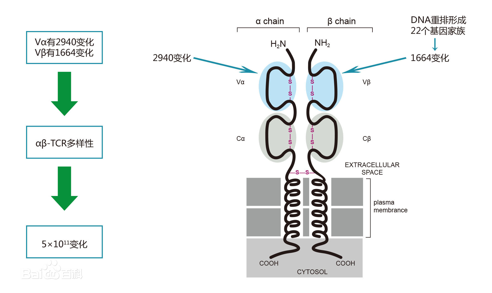

# TCR Backgrounds

## Links:
1. definition:
  - https://icbi-lab.github.io/scirpy/tcr-biology.html
  - https://icbi-lab.github.io/scirpy/glossary.html#term-CDR
2. tutorial:
  - https://icbi-lab.github.io/scirpy/tutorials.html
  
## Basic Biology knowleadge
  - Every single paire of TCR basically ocntains two chains. 
    
  - The variable regions make sure the deversity of T cell receptors. 
  - Complementary-determining region. The diversity and, therefore, antigen-specificity of TCRs is predominanly determined by three hypervariable loops (CDR1, CDR2, and CDR3) on each of the α- and β receptor arms. CDR1 and CDR2 are fully encoded in germline V genes. In contrast, the CDR3 loops are assembled from V and J segments (TCR-α) and V, D and J segments (TCR-β) and comprise random additions and deletions at the junction sites. Thus, CDR3 regions make up a large part of the TCR variability and are therefore thought to be particularly important for antigen specificity (reviewed in [AHS15]).
    
  - The variability of TCR chain sequences originates from the genetic recombination of Variable, Diversity and Joining gene segments. The TCR-α chain gets assembled from V and J loci only, the TCR-β chain from all three V, D and J loci. As an example, the figure below shows how a TCR-α chain is assembed from the tra locus. V to J recombination joins one of many TRAV segments to one of many TRAJ segments. Next, introns are spliced out, resulting in a TCR-α chain transcript with V, J and C segments directly next to each other (reviewed in [AHS15]).
    

## 10x format TCR Data
  You only need to understand the table of TCR produceed by 10X Genomics.
  
