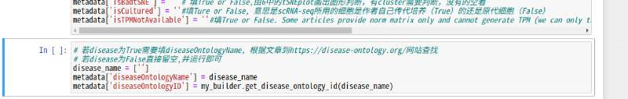
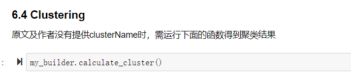
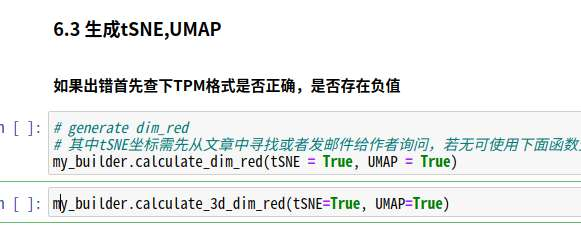
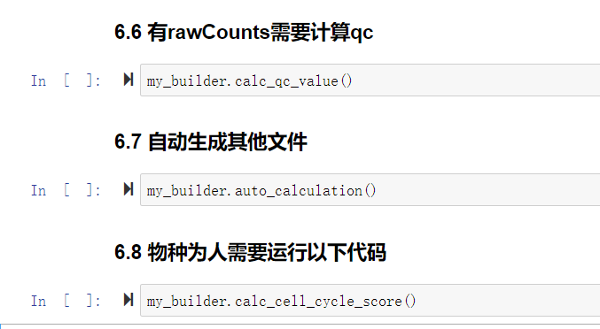
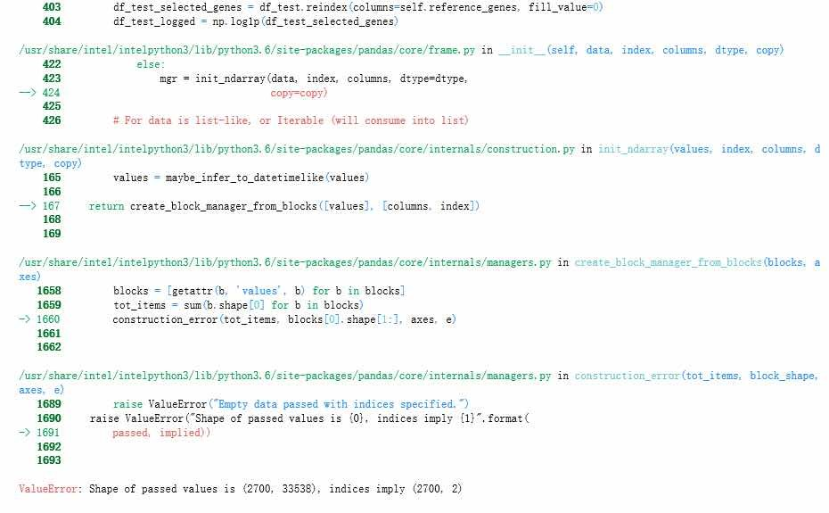

# 实习生标注、修改和审核教程

#### 注：
- 1. 数据集分发时就需要在redmine上标清楚是分发给谁的，方便溯源。
- 2. 二审/三审负责人发现错误后需要在redmine上更新feedback来发布修改任务
- 3. report中需要用修订模式指出错误，返回修改时一并附上。
- 4. 实习生数据标注指南、修改指南和审核人员审核指南见下文。
- 5. 同一时间下发的数据集争取在同一个周期内完成。如，每周下发10个数据集，那么每周尽量收上来10个数据集。

## 目录
- 如何给新实习生注册用户？	3
- 注册好的实习生该做些什么？	3
- 实习生数据集标注以及修改指南	4
- 数据集标注指南	4
1.	Report：	4
2.	unstructuredData需要摘录的信息：	4
3.	cellAnnotation	9
4.	Matrix	12
5.	生成的其他文件：	16
6.	运行检查器（之后可以让陈淳继续添加）	18
7.	遇到的问题与解答	18

- 实习生数据集修改指南	23
1. 以下代码是运行配置项，需要在修改数据集的时候运行	23
2. 以下三个部分的数据如果进行了修改，需要注意运行下面的自动化函数：	24

- 审核人员审核指南	27
1. 一审	27
2. 二审：	30
- 二审 修改回收步骤：	30
- 补充教程：	32
3. 三审	35
- 三审 修改回收步骤：	35
4. 审核的汇总表格流程	36

## 如何给新实习生注册用户？
Redmine用户注册：需要由管理员权限的人在administration中的user选项卡中添加用户。
Linux用户注册：由李玥负责提供 端口号、密码和服务器IP。

## 注册好的实习生该做些什么？
1.	安装软件登陆账户
2.	教程：
1)  pdf版教程（包含流程步骤及注意事项）
服务器设置.pdf
数据集文件结构以及文件内容解说.pdf
2) 视频教程（有错，不建议细看，之后会有更新），以及邮件模板
 https://pan.baidu.com/s/1NAJ6_BVTdB1IarZXh6gHaw 提取码: hbmm
3) 有用的教程
- Linux（只看前四章就可以满足基本需求）： 
  - http://c.biancheng.net/linux_tutorial/

- Python： 
  - http://c.biancheng.net/python/

- scRNA-seq analysis： 
  - https://scrnaseq-course.cog.sanger.ac.uk/website/index.html
  - https://scanpy-tutorials.readthedocs.io/en/latest/pbmc3k.html
  - https://satijalab.org/seurat/v3.1/pbmc3k_tutorial.html

3.	 按照《实习生数据标注指南》完成用户帐号下的测试数据集，并把做好的script.ipybn中的所有表格展开，把这一网页生成report.pdf，交给二审负责人：张萌栩。等待批注回复。

# 实习生数据集标注以及修改指南

# 数据集标注指南
### 注：文献具有时效性，实习生若是在一周内无法完成分配的数据集，需要及时向管理人员汇报。进行数据标注，需要从data/tutorial/template/code/文件夹下复制script.ipynb代码文件模板到自己的文件夹下参考运行. 不可以直接在模板中运行！！！脚本会随时更新，请随时关注新加入的字段，不要一直使用自己存在文件夹下面的script，每次用都从template下复制最好。

## 流程：审核人员下发任务到redmine——拿到数据集——进行标注——生成pdf版本的report——redmine回复完成并附件添加report——等待二审和修改
## 1.	Report：
每新标注一个数据集，都要把自己写的代码，每一个表格尽可能的展开，把网页打印-选择生成pdf版，并把文件重新命名为report_数据集编号_用户名和名字_日期.pdf, 然后预备役实习生交给二审人员
如，report_GSE*****_user_72_zhangsan_20200320.pdf，正式实习生直接贴在redmine任务平台相应任务下。
## 2.	unstructuredData需要摘录的信息：
- subDataset：由一审人员写在description.txt上，请复制过来
- description：由一审人员写在description.txt上，请复制过来
- correspondingFigure：由一审人员写在description.txt上，请复制过来
- title：注意这里填写的是文章的title，不是GSE界面的title！注意不要title不要加句号
- authors：使用内置函数获取，script中的引号内填pubmedID
- accessionNumber：这里填写GSE开头的编码,可以在pubmed网站中文章下面的Associated data这一栏获取，一般GSE三个字母后面有5位数。
- pubmedID：填写pubmed编号，pubmed网站上文章题目下面的PMID就是。
- keywords： 使用内置函数获取，script中的引号内填pubmedID
- abstract：把文中的abstract一段复制下来，注意不要多了或少了。不要填写GSE界面的summary!
- sourceID：出现在pubmed网站中文章题目下方。DOI的网络连接，如一篇文章的DOI为10.1038/nature12172，那么它的网络链接为https://doi.org/10.1038/nature12172
- libraryPreparationMethod：是指细胞测序所使用的技术，可在文章中查找；也可以在文章相应的GEO网址中（即在GEO网站首页输入GSE编码即可）查找。文章中的技术，使用my_inspector.libmethod_keywords调出关键词： 10x chromium(注意不要随便更改大小写！), drop-seq, microwell-seq, C1 Fluidigm, inDrops, Smart-seq2, Smart-seq, CEL-seq, CEL-seq2, MARS-seq, msSCRB-seq, SCRB-seq基本上都出自于上面几种测序技术。
- sequencingPlatform：这里填写测序平台。可以在文章相应的GEO网址中找到。如，Illumina HiSeq 2500，Illumina HiSeq 500，Illumina HiSeq 2000等。
- clusteringMethod：这里填写聚类分析的所使用的方法，可在文章中查找。聚类分析常用方法：k-means, affinity propagation, mean-shift, spectral clustering, Ward hierarchical clustering, agglomerative clustering, DBSCAN, Gaussian mixtures, birch.
    

    想要更详细的了解可以参考以下网址：https://blog.csdn.net/ztf312/article/details/97951928
- biomarkerDerivationMethod：是指marker gene的算法，一般在文章的method里面有，是找cluster下游的特异基因的方法。一般是t-test或者wilcoxon之类的，尽量在文章中找到对应的marker genes的算法。
- fastqURL：在EBI网址上查找文章名字，然后点击相应链接，查看data信息，链接就会跳转到一个有大写字母PRJNA和一串数字结尾的地址，如 ：https://www.ebi.ac.uk/ena/data/view/PRJNA542142其实只要网页里面有文章的fastq相关信息即可
- figureURL：填写文章的摘要图网址。对于明确表示有graphic abstract 的文章，我们需要把这张图放在展示页面上，如果没有graphic abstract，那么放文章的第一张图。可以在文章页面访问原图，使用原图链接，或者访问杂志网站，使用杂志提供的图片链接。图片链接结尾一般是*.jpg .png .gif之类的文件形式。链接需能在浏览器中打开，但不可使用只自动下载的图片。
- codeURL: 如果作者提供了代码，需要把链接填写在这里。一般会在文献中的codeAvailability中找到github链接或者dropbox链接，里面有时会有cluster信息，请仔细查看。
- dataURL: 非GSE数据没办法填写GSE开头的accession number的数据集需要填写此项。
- isFigurePublic：填True or False, 是否对所有网络均公开可见，如一般abstract中的figure为公开的，就填写True。
- taxonomyID：可查看文章相应的GEO网址中的sample里的信息，一般人填9606， 鼠填10090（只用填写了这个才能生成geneannotation）
- genomeBuild：可查看文章相应的GEO网址中是否有相应字段。人为hg/GRCh，小鼠为mm/GRCm这类格式，其他物种可以填notAvailable。
- annotation: 是指基因的注释信息是什么
- journal： 使用内置函数获取，引号内填pubmedID，如无法获取，使用命令my_inspector.journal_keywords调用journal的列表查看，列表中没有该杂志名称的话就自己填写。
- citation: 指引用次数
- tissue：文中选填,填为list格式。需要在https://www.ebi.ac.uk/ols/ontologies/bto 这个网址查询是否有填写的tissue。tissue这个字段的设置是为了之后做筛选时能快速筛选出相应组织的所有数据集，例如melanoma这种黑色素瘤疾病，我们可以填写skin为tissue。冠状动脉可以填写成heart，可以填写的大一点。
- tissueOntology: 不填写，向下运行代码自动生成
- clusterAvailability：填True or False，意思是能否找到对应的cluster信息

### 以下字段为文章的研究主题
- disease：填True or False
- methodology：填True or False （True 仅包括本身研究测序方法的文章）
- cancer：填True or False
- neuroscience：填True or False
- developmentalBiology：填True or False （发育生物学，如细胞的分化）
- immunology：填True or False
- cellAtlas： 填True or False （遗传图谱）
- tSNEAvailability：填True or False, 意思是能否找到tSNE的坐标信息
- isBadtSNE: 填True or False,由6中的tSNEplot画出图形判断
- UMAPAvailability: 填True or False,意思是能否找到UMAP的坐标信息，同样需要发邮件
- isBadUMAP: 填True or False,由6中的UMAPplot画出图形判断
- （新加入）isCultured：填True or False，意思是scRNA-seq所用的细胞是作者自己传代培养的细胞系（True）的还是原代细胞（False）。
- （新加入）isTPMNotAvailable：填True or False。这个字段的意思时问这个数据集中的TPM矩阵是否是真正的TPM矩阵？因为：Some articles provide norm matrix only and cannot generate TPM (we can only treat the norm as if it is TPM)，找不到真正的TPM矩阵的时候填上True。但在矩阵的normalizationMethod这一列里要标注清楚'Copied from norm'，表示这个不是TPM矩阵！
- （新加入）diseaseOntology：在https://www.ebi.ac.uk/ols/ontologies/doid中寻找disease_name。
    
- （当cancer为True时需要填写）cancerDescription：按照script脚本里面的要求填写，文章不是cancer相关可以不填
   

### 对于各字段的说明：
- disease：是指文章研究内容是否与疾病有关，例如研究某种疾病、从疾病患者采样等，但对于一般性的研究某一通路、细胞等作用，最后认为可能与某种疾病有关时需要多加判断，准则是此篇文章出发的目的和主题内容是否是与疾病相关，此外，cancer必为disease；
- methodology：此为高出错字段，应更加注意。方法学是指文章开发了某一新的算法、分析方法、技术手段或者比较现有算法并进行评价的。很多文章习惯性采用“我们使用了新的策略”这样的表述，这种并不是方法学文章的特征，也并不是用了某一算法、框架的就是方法学，准则是“新”的方法以及文章主旨；
- cancer：很容易理解，研究主旨是关于癌症的；
- neuroscience：研究主旨、研究样本关于神经生物学或神经组织/细胞；
- immunology：研究主旨、研究样本关于免疫学或免疫器官/细胞；
- developmentalBiology：研究的是某一个体/器官/细胞类型/组织的时间跨度下的发展变化，关键字如发育、衰老、胚胎、分化等，此外，使用胚胎的文章大多可归为发育；
- cellAtlas：对某个个体、器官、组织、系统。进行全面普遍的研究，即关注的问题不是某一特定的细胞类型或组成的功能与变化，而是清楚表达其内部组织与层次关系，可以类比为“参考基因组”这样的概念，不是为了研究某个基因或某个人，而是为了提供可参考的人类基因组。也会有文章进行全面测序和分析后，只抓住某个点阐述，此时也仍属于cellAtlas，判断标准是测序的样本和数据是否包含了其采样的全部，比如有的取了肝组织，但只测肝内免疫细胞，则不符合要求，应该包括基质细胞、上皮细胞等等。

### markergene
-markergene 的填写一般是在文章supplementary information 里面查找存有markergene的excel表格。然后把excel表格里的markergene信息依次填写进字典中。
可以参考新手代码教程填写

## 3.	cellAnnotation
这里需要查看一些矩阵里的信息来完善cellAnnotation表格，需要用到代码
注意：没有的数据，不要留下NaN，若找不到信息就填成notAvailable。 
- 填写CellID: 一般在Matrix_rawCounts或者Matrix_normalized有对细胞的编号，只需要取出后安进cellAnnotation表格中的cellID这一列就可以了。
- 填写meta_字段：可以在读取了sample信息后查找是否有值得填写的字段，一般可以查看文章对应的GEO网址里面characteristic一栏中的信息来填写这一部分，注意需要与细胞一一对应。在填写sampleID的时候，需要注意GEO网站上的sampleID是GSM开头的，EBI网站上的sampleID是ERS开头。
- sample表格中的信息如何与CellID找到关系来填写cellAnnotation表格里的内容？
一般是通过sample表格中title这一列来寻找关系的：

   1） title中的信息与cellID信息相同，只是顺序不同: 可以借助循环代码历遍表格，利用当title中信息与cellID中信息相同时，才能填入cellID这一行的其他相对应的信息为条件，填入表格信息。

   2） 如果title中的信息和cellID不同，需要在sample这个表格中另外找能够跟cellID对应 起来的信息。再进行1）中操作。
- 填写clusterName和clusterID（tSNE and UMAP）: 

   1） 首先要在文章中的supplemental information栏下查找作者是否给了是否有相应的聚类信息（包括clusterName/clusterID，tSNE1/2, UMAP1/2等）。

   2） 还可以在读取作者提供的矩阵（文章对应的GEO网址下载的）中查找。
   
   3） 作者还喜欢在文章中的CodeAvailability中提供github链接或者dropbox链接，里面一般会有metadata和cluster信息。

   4） 如果都没有，需要发邮件给作者。（如果没有得到回复，审核人员可以再发一遍试试）

   5） 最后也没找到clusterName/clusterID的可以先填写上notAvailable，之后运行我们自己的计算脚本，自动生成为数字编号的clusterName/ID、tSNE1/2、UMAP1/2。这部分代码出现在template/script.ipynb中的6.使用脚本自动生成其他项中的6.4，同时cellAnnotation的表格中会多出来两列：clusteringMethod 和 clusterName_scibet。如下图：

   

   6）若tsne和umap作者也没有提供，跟cluster一样，实在不行可以运行自己的脚本自动计算。6.3中的代码生成2D（第一行代码） 和3D的图（第二行代码）

   

- 填写cellOntologyName和cellOntologyID：这两项与clusterName是相对应的
   1） 如果文中提供clusterName等相关内容，cellOntologyName/ID可以在https://www.ebi.ac.uk/ols/index网址搜索细胞信息，并输入与clusterName最相近的cellOntologyName和ID (id现在已经不需要填写，运行6.5代码根据cellOntologyName自动生成)

   

   2） 如果文章没有找到clusterName，那么就只能在文章中寻找进行聚类分析的是什么细胞，有时候只能找到这篇文章是研究**细胞的，如骨髓细胞，那就只查找骨髓细胞相应的cellOntology信息并全部填上即可。目的就是填上就好，能填就填，轻易不要填notAvailable，更不可以空着。

## 4.	Matrix
### 注：当文献里面细胞数目超过1 万时，需要把矩阵存成mtx格式，一旦存了mtx格式，所有矩阵都需要存成mtx格式。 

#### 从 Matrix_rawCounts 或 Matrix_normalized 生成 TPM
注意：Matrix_normalized 优先于 Matrix_rawCounts 使用生成TPM。

#### 若作者只提供了TPM 矩阵：
需要把矩阵存到tpm和norm矩阵里面，normalizationMethod分别填写:TPM from author; TPM

### Cell number, 即有效细胞数的判断：
（有效细胞数即数据整合后或经过 normalization 后被使用的细胞数。）
1.	文章中给出，可以是几种细胞数的和。
2.	通过 Matrix_normalized 的 row number 数判断：cell number = row numbers (有时需要根据情况随机应变)
建议用方法2复查方法1中作者提供的有效细胞数。

### 为什么要用 TPM：
在大数据中查询基因表达时，不同数据集在同一个scale上便于比较，因而要有统一的标准。

### 为什么尽可能不用 rawCounts 生成 TPM：
Matrix_normalized 中数据往往是对 Matrix_rawCounts 数据做出某些处理后所得，尤其是经过 gene or cell filtering。因此，通常 Matrix_rawCounts 可能有更多的 cell，即存在无效细胞。因而 Matrix_rawCounts 列表就可能和后面的 cellAnnotation 不对应，故后续无法用其向 cellAnnotaion 表格中插入数据。

### 判断 downloaded data 是 Matrix_rawCounts 还是 Matrix_normalized：
根据测序原理，检测结果 Matrix_rawCounts 中一定全为整数，有负数则不是 Matrix_rawCounts。当算法为pseudo alignment（kallisto等，这种算法越来越受欢迎）时，会出现小数。

### 判断是否直接使用 Matrix_rawCounts 生成 TPM：
当且仅当文章未提供 Matrix_normalized 数据，可以直接用 matrix_rawCounts 生成TPM。

### 判断下载的 Matrix_normalized 是否可以直接用于生成 TPM：
作者在文章 method、analysis 部分可能提及使用 multi-step normalization strategy，诸如使用 previously described method, reduse batch effects, use ComBat method, etc. 
如若不确定直接下载的 Matrix_normalized 数据是否经过 logarithm transciption，则使用下载的 Matrix_normalized 数据生成TPM矩阵，并检查TPM的正确性。TPM 正确即表明 Matrix_normalized 中数据可以直接使用。若 TPM不正确，则需间接使用 Matrix_rawCounts 生成 TPM。

### 如何填写normalization method?
下载的normalized矩阵和生成的TPM矩阵都需要填写一列normalizationMethod。
  1)	Normalized矩阵：一般是下载得来，需要在文献中找出normalized Matrix是怎样被标准化的，有的是FPKM,有的是RPKM,还有log2（TPM+1）等等形式，载入normalizedMatrix的时候需要在第一列标明normalizedMethod。格式： 如，FPKM。（直接填写原文作者把rawcounts标准化的方法，不要添加其他字符。）
  2)	TPM矩阵：
   - 如果由rawcounts矩阵转化而来，填写：TPM from raw counts
   - 如果由normalized矩阵转化而来，填写： TPM from FPKM （根据normalized矩阵的方法而改变，如：TPM from log2（TPM+1） ）
  3)	如果遇到无法转换成TPM的，TPM的normalizationMethod一定要强调这个不是TPM！并且一定要很详细的注明这个矩阵的标准化方法是什么, 如：矩阵不是TPM! 是TMM矩阵。如果是mtx格式，需要再在uns里面加一个字段写清楚:TPMNormalizationMethod: directly copied from TMM, not TPM.

### 检查TPM矩阵正确与否方法：
TPM中横行代表基因，纵列代表细胞。对于任意单个细胞，当其对应横行中的基因值相加和为1000 000 (10^6)，则TPM正确。如果文章提到使用UMI, 那么CPM（也叫RPM） = TPM, 行和都是一百万，M代表million。

### 间接使用 Matrix_rawCounts 生成 TPM：
注：当需要用Matrix_rawCounts自动生成TPM时需要先填写unstructuredData中的libraryPreparationMethod。
在文章作者给出 Matrix_normalized 情况下，判断是否可以直接用 Matrix_normalized 生成 TPM，或者仍需使用 Matrix_rawCounts 部分数据生成 TPM 的方法：
1.	作者于文章 data analysing/processing 中明确指出 median normalize (to zero)，或者 Z-Score、TMM，以及一些依赖函数库的结果不能使用 Matrix_normalized 生成 TPM，要根据 matrix_normarlized 中的的 cell ID 挑选出 Matrix_rawCounts 中的的有效 cell ID，使用有效cell ID生成仅包含有效细胞的新Matrix_rawCounts，用其生成 TPM。
2.	作者文章 data analysis/process 部分未发现不可用 normalized data 生成 TPM 的条件，则可做一个 Matrix_normalized。如果该 Matrix 里有负数，则作者 normalization 方法可能为 median normalize (to zero)，或者 z-score 等等。此时同样需从下载的 Matrix_rawCounts 中根据 cell ID 挑选出 Matrix_normalized 中使用的有效细胞，再使用筛选细胞后的新 Matrix_rawCounts 生成 TPM。

### 从 logarithmic transformed Matrix_normalized 到 TPM：
若作者明确提供的 Matrix_normalized 已经经过log变换, 如log2（TPM+1），则需逆推原始 Matrix_normalized，再使用原始 Matrix_normalized 生成 TPM。
logaN, a = 2, 10, e..., TPM = a^N /100 000，normalizationMethod: loga(TPM+1)
特例：如果文章写明使用 logarithmic transformed data，但并未指出是何种log变换，尝试用log2、log10、ln等等变换后 Matrix 每行基因和均不为1000 000，且每行基因的和相近，则可以直接在 Matrix_normalized 基础上进行归一化，即每个基因除以该行基因的和，再乘上1000 000。

### 从FPKM, RPKM到TPM的转换：
接将 Matrix_normalized这个 矩阵除以 行的和 乘上 1000 000，这样得出来的就是 TPM 矩阵了。 
示例代码：（需要根据不同的情况变换，仅作示例）

    df_downloaded = pd.read_csv ('../downloaded_data/GSE_supplementary_data/GSE75413_genes.fpkm_table.txt.gz', sep = "\t",index_col = 0)                  
    #读取矩阵
    df_downloaded.head()   
    #显示矩阵前前5行出来看看

    df_norm = df_downloaded.T  #行和列交叉互换，即行变成列，列变成行
    df_norm.head()

    fpkm_array = df_downloaded.T 
    b = np.sum(fpkm_array,axis=1)
    df_tpm = fpkm_array / b.values.reshape(-1,1) * 1e6          
    #1e6代表1 million

## 5.	生成的其他文件：
1. TPM需要从rawcounts生成时，运行6.1（注意：只有当libraryPreparationMethod填写完了之后才能运行成功）
2. geneAnnotation文件：这个是运行代码自动生成的，在script.ipynb中的6.2可见。（注意：只有taxonomy填写了物种的编码之后才能成功生成）
3. 当真的没有tsne和umap坐标没办法从作者那里得到回复时，可以运行我们自己的计算脚本，计算tSNE和UMAP的二维和三维， 运算脚本在script.ipynb中的6.3可见。
4. clustering计算，在6.4中，仅在找不到作者又未回复时使用，记得运行第二行代码来判断isbadtSNE，来判断tSNE图上的细胞簇点是否能分得开。
5. cellOntologyID，在6.5中运行后根据cellOntologyName自动填写
6. 还添加了一些需要运行的代码在6.6-6.8中
   
7. 填写README:
   - 第一个block里面运行的代码用来赋值和读取readme.json
   - 第二个block里面填写信息
    Readme['author'] = ''  #填写自己的名字拼音，如 Xiaoming
    Readme['date'] = ''     #填写完成日期
    Readme['modificationDate'] = '' #填写修改日期
    Readme['unfinishedParts'] = [''] #未完成的部分，包括矩阵及cellAnno中的cluster等
    Readme['authorComments'] = '' #如果数据分成了几个part，写清楚该part代表什么类型的数据
    Readme['otherComments'] = ''
- 最后记得保存

## 6.	运行检查器（之后可以让陈淳继续添加）
运行代码my_inspector.inspect()
在运行检查器后经常会出现报错，这时就需要根据检查器报错来排查错误信息
常见报错：
1.	 unstructuredData中缺少内容：

   

 只需要补充上即可。

2.	markergenes
   

 markergenes中缺少ensemblID,这个ID是有内置函数换算的，是跟gene一一对应的。
 这里报错是因为cluster里的ensemblID都为notAvailable，这可能是因为函数没有运行正确，也有可能是基因库没有对应的。可以重新运行试试，如果还是没有，可以在群里询问。

3.	如果没填写libraryPreparationMehtod或者taxonomy就想生成toTPM或者geneAnnotation，也会报错提示

## 7.	遇到的问题与解答
1）	rawcounts文件太大，生成TPM总是崩溃怎么办？
   - 答：可以试试存成sparse matrix，这样会小一点，然后再转成TPM。细胞超过5万以上的就不要存成tsv格式了。现在如果只提供rawcounts，都需要生成mtx格式的矩阵。

2）	 libraryPreparationMethod里面的msSCRB-seq是什么？
   - 答：是molecular crowding SCRB-seq。https://omictools.com/mcscrb-seq-tool

3）	 jypyter_no_port错误解决方法？
   - 答：百度网盘里有文档解释
   https://pan.baidu.com/s/1NAJ6_BVTdB1IarZXh6gHaw 提取码: hbmm

4)	TPM矩阵如何从sparse matrix转换过来？
   - 答：rawcounts存储为sparse matrix时运行my_builder.toTPM()这个函数生成TPM #运行这个函数前，需要保证rawcounts.tsv  这个文件是空的才行

5)	在读取文或运行件的时候，跳出received signal 15，stopping然后shutdown是什么原因呢？有什么处理办法吗？
   - 答：这种情况一般是因为运行的文件占用内存太大，被程序自动kill了，可以尝试在人少的时候再试试，是在不行就联系发任务的人。 

6)	在运行auto_calculation的时候，显示clusterName Error！怎么办？
   
 
   - 答：没有cluster的信息时要先填上notAvailable，再用我们自己的脚本计算cluster，不能留下NaN。

7)	在运行calculate_cluster（RUN = True）的时候报错，是什么原因？

   
 
   
 
   - 答：
      （1）第一张图报错中显示细胞数只有47个，细胞数太少的时候不需要进行细胞聚类。

      （2）第二张图遇到报错可以先运行检查器，查看其他部分是否填写完整无误。在这里 如果rawcounts存成mtx格式在生成tpm就不需要运行geneAnnotation函数了，要不然会覆盖掉。（现在已经优化了代码，不让你运行geneAnnotation了）

      （3）出现ValueError: cannot reindex from a duplicate axis报错,是因为矩阵中基因名或者细胞名可能有重复。基因名有重复可以使用ensemblID代替基因名，若不行可以在重复的那一列做个标记区别开来。系报名重复时，同一个细胞的基因表达量应该是一样的，因此需要去除重复的细胞。
 
8)	metadata中的信息有时使用my_builder.get_metadata('')#引号中填写pubmedID获取不到相应的信息，这是为什么？
   - 答：可能是因为文章中本来就没有，可以在文献里确认一下，文献中确实没有的就算了。

9)	metadata中的tSNEAvailability需要发邮件问作者吗？
   - 答：新标注的时候需要发，修改数据集的时候可以不用发。

10)	 citation的次数在哪里找？
   - 答：pubmed中会有，也可以直接google

11） 从rawcounts生成TPM有时候会有基因数不一样的情况
   - 检查后发现rawcounts矩阵中多出的基因为ERCC开头，这种情况时不用管就行了

12） 矩阵存成mtx格式之后运行auto_calutation还是会超时断开，就只能收回来在infinity上跑了。或者先清一下服务器内存看看。清服务器内存可以看 数据节省内存文件夹

# 实习生数据集修改指南
### 标注数据集之后的修改注意事项从2开始，不用新建文档，在自己的代码中修改即可(新标注数据集都不需要运行downsample相关的函数！！！)
### 回溯型数据集的修改注意事项从1开始，需要新建文档，不可以在别人的代码上修改！！（当有回溯型的数据集需要修改的时候，再放出给实习生）实习生收到修改意见后，需要另外新建一个phthon3的文件，命名为revision.ipynb，在这个文件中修改标注的数据。
## 1. 以下代码是运行配置项，需要在修改数据集的时候运行
    import importlib.util
    import sys
    import os 
    import pandas as pd
    import numpy as np
    from scipy.io import mmread, mmwrite
    import scanpy as sc
    import anndata as an
    import louvain
    sys.path.append('/home/biodb/data/abio_database_pipeline_new/') 
    #注意如果是在阿里云服务器上，该地址改为：'/home/ztr/abio_database_pipeline_new/'
    from pipeline.datasets_curation import datasetBuilder
    from pipeline.datasets_curation import inspector
    from pipeline.datasets_curation import downsample
    starting_dir = '/home/biodb/data/user_33/No_1/part_1' 
    #根据自己更改的数据集更换路径
    my_inspector = inspector.Inspector(starting_dir)
    my_builder = datasetBuilder.DatasetBuilder(starting_dir)
    my_downsample = downsample.Downsample(starting_dir)

## 2. 以下三个部分的数据如果进行了修改，需要注意运行下面的自动化函数：

### (1) 矩阵
### (1.1) raw counts, normalized变动，需要考虑重新生成TPM矩阵；（注意TPM如果重新生成了，参考1.2运行自动生成函数）
### (1.2) TPM矩阵如果变化了，所有自动生成函数都需重新运行，包括：
    my_builder.generate_geneAnno()
    my_builder.calculate_dim_red(tSNE = True, UMAP = True)
    my_builder.calculate_cluster(RUN = True) #注意参数RUN=True会将原cluster信息删除并更新，所以如果原文提供cluster信息的时候不要运行该行！

    #以下两个函数最后运行
    my_builder.auto_calculation()
    my_downsample.downsample() #如果需要运行该函数，必须先将原来的downsample_data文件夹删除！

### (2) cellAnnotation（以下情形为矩阵未改动的情形，如矩阵变动参考1.1）
### (2.1) clusterName改动，需要重新运行：
    my_builder.auto_calculation()
    my_downsample.downsample(tpm_downsampled = True)
### (2.2) clusterName没变，其他部分变动
    my_downsample.downsample(tpm_downsampled = True)  # 当细胞超过4000个时运行，不需要运行其他代码
### (2.3) 其他
cluster如果是用函数生成的话会多出两列：clusteringMethod和clusterName_scibet。
所以如果是后面找到原文提供的cluster信息填入之后，需要将原来这两列删除。

### (3) metadata
直接更改unstructuredData.json文件即可
有几个字段需要格外注意下：
- 1.关于人的数据一般都能找到tissue，不可填为notAvailable;
- 2.research topic那几个字段，即cancer，disease等已经统一检查过了，一般情况下不需要更改，不确定的请咨询；
- 3.genomeBuild也是统一核查过的，一般没有错，注意不要改错了。
- 4.metadata里面多出来的字段不要删掉！少的需要加上！

### (4) 其他注意事项
- 4.1 每改完一个问题需要进行汇报；更改数据的代码需新建一个代码脚本进行更改，不要直接在别人的代码上改，相应代码的脚本需放在code文件夹中，命名为revision，同时需要有详细的注释解释更改内容。
- 4.2 不清楚的函数或者代码内容可以参考代码目录里面的脚本
- 4.3 更改完成之后需通过检查器检查之后再进行报备

