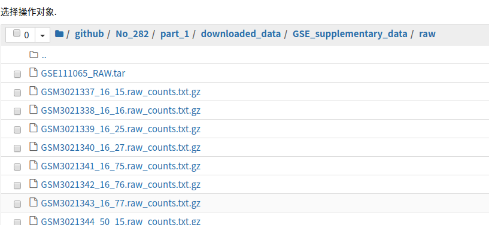
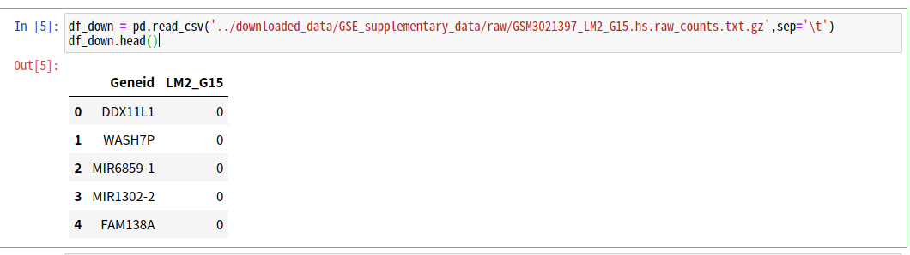
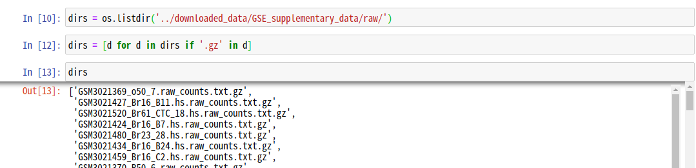

## 数据集节省内存笔记(以No_282为例)

1.  矩阵合并

    -   先查看下载文件

    

    -   先读取一个文件查看矩阵格式

        ```python
        import pandas as pd
        
        df_down = pd.read_csv('../downloaded_data/GSE_supplementary_data/raw/GSM3021397_LM2_G15.hs.raw_counts.txt.gz',sep='\t')
        df_down.head()
        ```

    -   可以看到这里只有一个细胞,即列名为cellID,所以后面需要矩阵转置

        

    -   获取所有下载文件列表

        ```python
        import os
        
        # 将../downloaded_data/GSE_supplementary_data/raw/改为你的数据集下载目录
        dirs = os.listdir('../downloaded_data/GSE_supplementary_data/raw/')
        # 简单过滤文件
        dirs = [d for d in dirs if '.gz' in d]
        ```

        

    -   开始合并

        ```python
        from scipy import sparse
        import gc
        
        matrix = None
        cellID = []
        genes = []
        
        for file in dirs:
            # 读取矩阵并转置, index_col=0 指定第一列为index这个看数据集情况选择是否添加
            df = pd.read_csv(f'../downloaded_data/GSE_supplementary_data/raw/{file}', sep='\t', index_col=0).T
            
            # 将dataframe转为coo矩阵,注意dataframe 的 values不能有字符串,否则转换失败
            matrix_new = sparse.coo_matrix(df)
            
            # 若为循环第一次则直接matrix_new赋值给matrix, df的列名赋值给genes(注: 这里df上面已经转置)
            if matrix is None:
                matrix = matrix_new
                genes = df.columns.to_list()
            else:
                # 利用 sparse.vstack进行垂直方向合并矩阵, 与之对应的是sparse.hstack
                # 参考链接: https://docs.scipy.org/doc/scipy/reference/generated/scipy.sparse.vstack.html
                # https://docs.scipy.org/doc/scipy/reference/generated/scipy.sparse.hstack.html
                matrix = sparse.vstack([matrix, matrix_new])
             # 与genes不同的是, cellID采用累加的方式, 因为一般来说一个数据集的多个下载文件中基因名是一样的
            cellID += df.index.to_list()
            
            # 为了节省内存, 需要及时del 掉循环中占用内存较多的临时变量如: df和matrix_new, 然后运行gc.collect()
            del df, matrix_new
            gc.collect()
            print(f'finished {file}')
        ```

2.  矩阵保存

    -   直接运行以下代码保存

        ```python
        my_builder.save_template_mtx(mtx=matrix, mtx_name='expressionMatrix_rawCounts.mtx', genes=genes, cellID=cellID)
        ```

3.  释放内存补充

    -   Python中释放内存可以先 del 掉该变量, 然后运行gc.collect()

    -   如果数据量较多,可以保存完矩阵后就重启脚本一遍(释放所有内存),再运行计算TPM等计算的代码

4.  其他: 如果数据细胞数很多如: 有几十万甚至几百万个细胞, 那么这个数据集不适合在小内存的服务器上计算, 请联系发数据集的人员处理